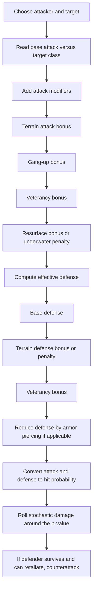
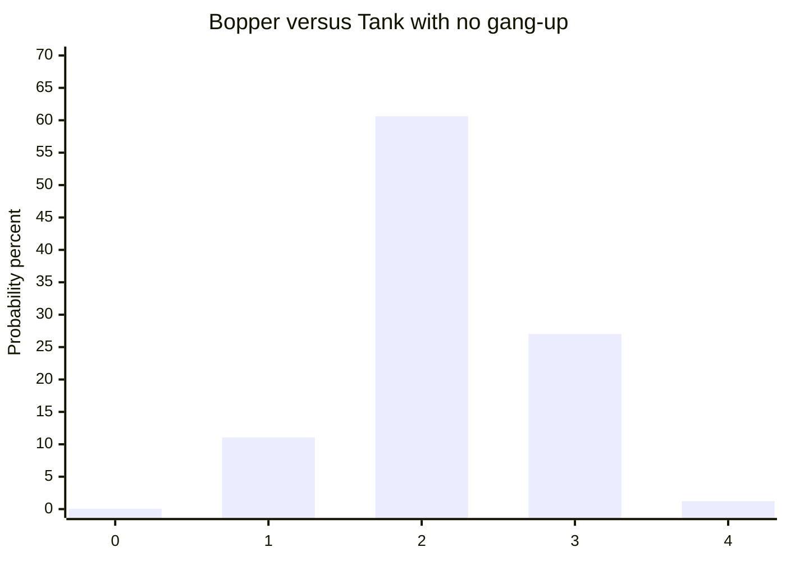

# UniWar Mechanics and Balance Report

## Executive summary

UniWar remains a deep asynchronous hex-based tactics game with three asymmetric races, a public ladder, tournaments, a large custom-map ecosystem, and a combat system built around positional modifiers rather than hidden “crit” events. The most important mechanical levers are unit stat matchups, terrain modifiers, gang-up geometry, special abilities, submerged/buried states, and tempo tools such as teleport or move-after-attack. The official web documentation is useful but partially outdated: the how-to pages still describe three races with eight units and four unit types, while the current official unit index shows eleven units per race including transformed units, and the live store listing describes ten buildable unit types per race. Current accessible sources therefore need to be reconciled across official unit pages, the official how-to pages, the official version history, and the sanctioned community damage calculator. citeturn43search0turn11search11turn29view0turn25view0

The most reliable current numeric data are the official per-unit pages. Those pages expose cost, movement, vision, repair points, defense, attack values versus Ground Light, Ground Heavy, Aerial, Aquatic, and Amphibian targets, separate submerged or buried values where relevant, armor-piercing values, resurface bonuses, and whether a unit can attack after moving or teleport. On that basis, the broad balance picture is stable: Sapiens are tempo-flexible and value-efficient, Khraleans lean on mobility, swarm pressure, plague, and air presence, and Titans excel at teleport tempo, anti-air, artillery, and hard front lines. citeturn11search11turn12view2turn16view1turn18view3turn19view0

For damage, the official sources say combat depends on attacker attack strength, defender defense, terrain, special bonuses, and chance; the best community explanations, which align with the official calculator’s “p-value” presentation, model damage as a probability process centered on `p = 0.5 + 0.05 × (effective attack − effective defense)`, with armor piercing reducing defense before the p-value is computed. The official calculator changelog further states that p-values are truncated to two decimals to match game arithmetic, and that defense after armor piercing should not be rounded first. I found no credible evidence of a separate critical-hit mechanic; variance appears to come from the core hit-probability process itself. Confidence on the exact closed-form formula is **medium**, because it is community-reconstructed rather than published by the developer in formula notation. citeturn23search0turn24search0turn24search2turn24search4turn35search1

## Sources and confidence

The primary source base consists of the official web “how to play” pages, official per-unit stat pages, the official ladder and tournament pages, the official iOS store listing, and the official version-history text file. The developer branding on the website is entity["company","Spooky House Studios","mobile game developer"], while the current store listing names entity["company","SH Limited","mobile game publisher"] as the developer/publisher on iOS. citeturn43search3turn11search11turn29view0turn25view0

A key documentation gap is that the public how-to section is frozen at `2020-04-14 v124`, still describing three races with eight units and four unit types, while the unit pages and app listing clearly reflect the later amphibian and underwater expansions. The official unit pages also expose an Amphibian attack column, which the old how-to pages do not mention. Because of that mismatch, any claim about newer terrain categories, visibility interactions, or progression systems has to be graded carefully. citeturn43search0turn11search11turn29view0turn25view0

I therefore use three confidence tiers throughout this report. **High confidence** means directly stated on current official unit pages or official rules pages. **Medium confidence** means supported by the sanctioned UniWar Damage Calculator or by multiple long-standing community sources that agree with the official UI. **Low confidence** means community-only claims not mirrored in currently accessible official web text, especially around full terrain matrices, exact ranking formula details, and some line-of-sight edge cases. citeturn36search3turn33view0turn31view0turn39search0

## Core rules and combat resolution

A match proceeds by alternating player turns. At the start of your turn, you receive credits from captured bases, then spend those credits, move, attack, capture, repair, or use specials with available units. Once a unit has completed all available actions, it cannot be used again until your next turn. If a unit is still available at end of turn and damaged, it auto-repairs. Capturing a base or harbor takes one round to complete. Harbors are required to build aquatic units but do not generate credits; medical tiles cannot be captured and repair three times the normal amount. citeturn43search3turn43search2turn23search3

The official rules also confirm that movement is terrain-limited and additionally constrained by Zone of Control, although no exact public formula for ZoC was found in the accessible official documentation. There is no separate “initiative” stat published on current unit pages; ordering is determined by player input during the turn, while retaliation depends on range and status rather than a speed-based initiative mechanic. This is an important distinction from some other tactics games: UniWar’s sequencing advantage comes from movement, position, and action economy, not hidden initiative rolls. citeturn31view0turn43search3turn11search11

The official rules say damage depends on attack strength versus target type, defense, terrain, special bonuses, and chance. The calculator and best community explanations model this as a chance-to-hit per health point that starts at 50% and shifts by 5 percentage points per effective attack-defense difference. In measured play, that means the practical average damage is close to `current HP × p`, where `p` is the effective hit probability after terrain, gang-up, veterancy, resurface bonus, and armor piercing. Community reverse engineering further describes the damage roll as multiple internal trials per HP, which is why outcomes cluster tightly around the expected value rather than swinging wildly. Confidence on this exact internal implementation is **medium**. citeturn23search0turn24search2turn24search4turn35search1

The most useful working combat model is:



That flow is directly consistent with the official rules page, the official gang-up description, official AP displays on unit pages, and the official calculator’s p-value framing. citeturn43search5turn33view0turn24search2turn24search0

Gang-up is one of the game’s most important positional rules. Officially, attacking the same target multiple times in one turn grants an attack bonus; the larger the angular wrap-around of the follow-up attack relative to the previous attack, the larger the bonus. The long-standing community mapping gives `+1`, `+2`, or `+3` attack to the follow-up strike. If the previous attack was ranged, the next attack gets only `+1` regardless of geometry. If the previous attack was melee, the next attack’s bonus depends on the attacking hex relative to the previous attacker. Community references also document two operational edge cases that matter for an engine implementation: the follow-up attack itself may still be ranged and keep the melee-derived gang-up bonus from its hex, and a follow-up can sometimes come from the same hex as the previous attack if that hex becomes vacant because of move-after-attack or unit death. Gang-up is **not cumulative** across a whole chain; each next attack is evaluated relative to the immediately previous attack. It persists across non-attack actions during the turn, but is lost if you end the turn or attack a different enemy. This is **high confidence** on existence and reset behavior, and **medium confidence** on the exact positional map, because the geometry is community-documented rather than currently fetchable from the official forum archive. citeturn1view0turn1view1

For bot and engine purposes, the gang-up rule can be written as a concrete state machine:

- Maintain `last_attacked_target_id` for the current player turn.
- Maintain `last_attack_origin_hex` for that target.
- Maintain `last_attack_was_melee`, where melee means the attacker was on one of the six adjacent hexes of the defender when attacking.
- A new attack gets gang-up **only if** it attacks the same target as `last_attacked_target_id`.
- Any attack on a different target resets the chain to that new target.
- Ending the turn clears the chain.
- Non-attack actions in between, such as moving other units or producing units, do **not** clear the chain.

The formal bonus rule for the next attack is:

1. If there was no previous attack on this target during the current turn, `gang_up_bonus = 0`.
2. If the immediately previous attack on this target was ranged, `gang_up_bonus = +1`.
3. If the immediately previous attack on this target was melee:
   - index the six adjacent hexes around the defender as directions `0..5` in clockwise order;
   - let `p` be the direction of the previous attacker relative to the defender;
   - let `s` be the direction of the current attacker relative to the defender;
   - compute `d = (s - p) mod 6`;
   - apply:
     - `d in {1, 5}` -> `+1`
     - `d in {0, 2, 4}` -> `+2`
     - `d == 3` -> `+3`

This is the exact community-preserved logic behind the color diagram:

- `same hex as previous attacker` -> `+2`
- `one step clockwise or counter-clockwise around the defender` -> `+1`
- `two steps clockwise or counter-clockwise around the defender` -> `+2`
- `opposite side of the defender` -> `+3`

The highest-value implementation notes are:

- The bonus is applied to the attacker’s attack stat before the damage roll.
- The rule is based on the **previous** attack only, not on the first attack in the whole chain.
- The second attack does not need to be melee; if the previous attack was melee, a ranged follow-up still uses its own firing hex to determine `s`.
- If the previous attack was ranged, geometry is ignored and the follow-up gets only `+1`.
- Because the same-origin case is `+2`, engines must not assume `s != p`; that hex can become available again through move-after-attack, multi-phase movement, or the previous attacker dying.

An engine-friendly pseudocode version is:

```text
function gang_up_bonus(previous_attack, current_attack):
    if previous_attack is null:
        return 0

    if previous_attack.target_id != current_attack.target_id:
        return 0

    if previous_attack.was_ranged:
        return 1

    p = hex_direction(previous_attack.origin_hex, current_attack.target_hex)
    s = hex_direction(current_attack.origin_hex, current_attack.target_hex)
    d = (s - p) mod 6

    if d == 3:
        return 3
    if d == 1 or d == 5:
        return 1
    return 2
```

This is the most detailed gang-up logic I can defend from currently accessible sources: the official `SPECIALS` page confirms existence and the qualitative “small / better / best” wrap-around rule, while the Fandom Gang Up page preserves the exact `+1/+2/+3` mapping, the non-cumulative rule, the ranged-first `+1` rule, the same-hex `+2` case, and the fact that non-attack actions do not break the chain. citeturn1view0turn1view1

The special-ability layer is numerically clearer. The Engineer’s EMP has radius 2, disables Titan units for one full round, and has a 10-round recharge; the Assimilator’s UV has radius 5, deals 1 damage to Sapiens and Khraleans, and has an 11-round recharge; the Infector’s plague infects nearby Sapiens, deals 1 damage at the start of each infected player turn, spreads to adjacent units, cannot kill by itself below 1 HP, and is cured by Medical or by repairing next to an Engineer. Engineers and Assimilators cannot move and use EMP or UV on the same turn, while Infectors can move and plague in the same turn. citeturn12view0turn17view2turn15view0turn31view0turn32search4

Transformation creates the three “progression” units: Mecha II, Infected Marine, and Cyber Underling. These units cost `0`, cannot be built directly, and are created by converting the opposing race’s basic infantry next to a support unit: Engineer reprograms Mecha, Infector infects Marine, Assimilator assimilates Underling. Once transformed, they do not revert. This is the game’s only hard unit-upgrade path inside a live match besides veterancy. citeturn43search5turn31view0turn12view1turn15view1turn18view0

Veterancy is community-documented rather than official-web-documented. The community wiki states that one stripe gives `+1` HP and `+1` attack, two stripes give `+2` HP and `+2` attack, and that each stripe requires experience equal to the unit’s original cost, gained by killing enemy units. Because the official calculator supports HP values up to 12, that community explanation is consistent with the current toolchain. Confidence here is **medium**. citeturn30search0turn24search2

## Units and faction arsenals

The following tables compile the base surface stats for every currently accessible official unit page. `Surf` is surface mobility. `Atk` is shown as `GL/GH/Air/Aq/Am`. Buried, submerged, armor-piercing, and other override values are summarized immediately afterward. Base tables are **high confidence** because they come directly from official unit pages. citeturn11search11turn12view0turn12view1turn12view2turn13view0turn13view1turn13view2turn13view3turn14view0turn14view1turn14view2

### Sapiens

| Unit | Type | Cost | Surf | Range | Vis | Rep | Def | Atk GL/GH/Air/Aq/Am | Role |
|---|---:|---:|---:|---:|---:|---:|---:|---|---|
| Marine | GL | 100 | 9 | 1 | 4 | 1 | 5 | 6/3/3/2/6 | Cheap capture infantry; best in Forest/Mountain/Base |
| Engineer | GL | 200 | 6 | 1 | 3 | 1 | 0 | 0/0/0/0/0 | Support, EMP, Mecha conversion |
| Mecha II | GL | 0 | 8 | 1 | 3 | 1 | 8 | 7/4/4/2/7 | Transformed infantry with teleport |
| Marauder | GH | 250 | 12 | 1 | 5 | 1 | 7 | 8/4/4/4/8 | Tempo striker; 2 actions |
| Bopper | GL | 300 | 7 | 3 | 3 | 1 | 0 | 3/5/1/5/3 | Anti-heavy blaster with AP |
| Tank | GH | 400 | 8 | 1 | 3 | 2 | 13 | 10/10/0/9/10 | Heavy anchor |
| Helicopter | Air | 500 | 12 | 1 | 5 | 1 | 10 | 12/7/10/8/12 | Generalist air control |
| Battery | GH | 600 | 5 | 2-4 | 4 | 1 | 4 | 10/6/5/10/10 | Long-range artillery |
| Destroyer | Aq | 800 | 12 | 3 | 5 | 2 | 12 | 10/10/12/16/10 | Capital ship, strongest anti-sea |
| Fuze | Amphi | 200 | 9 | 2 | 4 | 1 | 2 | 5/4/1/4/6 | Amphibious harasser |
| Submarine | Aq | 400 | 9 | 3 | 3 | 1 | 5 | 5/5/3/8/4 | Submersible skirmisher |

### Khraleans

These base stats are compiled from the official unit pages for Underling through Kraken. citeturn17view0turn15view0turn15view1turn15view2turn16view0turn16view1turn16view2turn16view3turn16view4turn16view5turn16view6

| Unit | Type | Cost | Surf | Range | Vis | Rep | Def | Atk GL/GH/Air/Aq/Am | Role |
|---|---:|---:|---:|---:|---:|---:|---:|---|---|
| Underling | GL | 100 | 11 | 1 | 3 | 1 | 5 | 6/3/0/2/6 | Fast capture/scout; bury threat |
| Infector | GL | 250 | 8 | 1 | 3 | 1 | 0 | 0/0/0/0/0 | Support, plague, Marine conversion |
| Infected Marine | GL | 0 | 10 | 1 | 4 | 1 | 6 | 7/4/4/2/7 | Transformed infantry |
| Swarmer | Air | 250 | 9 | 1-2 | 5 | 1 | 4 | 8/4/3/6/7 | Cheap ranged air pressure |
| Borfly | Air | 200 | 6 | 2-3 | 3 | 1 | 2 | 4/6/1/4/4 | Anti-heavy blaster |
| Garuda | Air | 350 | 12 | 1 | 5 | 2 | 9 | 7/8/9/8/7 | Durable air superiority / bruiser |
| Pinzer | GH | 450 | 8 | 1 | 3 | 2 | 13 | 12/10/3/10/12 | Heavy front-liner |
| Wyrm | GH | 550 | 6 | 1-3 | 3 | 1 | 4 | 10/9/12/10/10 | Mobile support artillery |
| Leviathan | Aq | 600 | 11 | 3 | 4 | 2 | 12 | 10/10/9/12/10 | Budget capital ship |
| Salamander | Amphi | 200 | 9 | 1 | 4 | 2 | 8 | 6/4/3/5/6 | Tanky amphibian with plague |
| Kraken | Aq | 350 | 10 | 2 | 3 | 2 | 8 | 6/6/0/6/6 | Cheap stealth sea threat |

### Titans

These base stats are compiled from the official unit pages for Mecha through Skimmer. citeturn17view1turn17view2turn18view0turn18view1turn18view2turn18view3turn19view0turn18view5turn19view1turn18view7turn18view8

| Unit | Type | Cost | Surf | Range | Vis | Rep | Def | Atk GL/GH/Air/Aq/Am | Role |
|---|---:|---:|---:|---:|---:|---:|---:|---|---|
| Mecha | GL | 100 | 8 | 1 | 4 | 1 | 6 | 6/3/4/2/6 | Teleport infantry |
| Assimilator | GL | 200 | 6 | 1 | 3 | 1 | 0 | 0/0/0/0/0 | Support, UV, Underling conversion |
| Cyber Underling | GL | 0 | 10 | 1 | 4 | 1 | 6 | 7/4/2/2/7 | Transformed burrower |
| Speeder | GH | 250 | 16 | 1 | 5 | 2 | 8 | 10/5/5/5/8 | High-tempo raider |
| Guardian | GL | 350 | 10 | 1-2 | 2 | 0 | 3 | 7/5/7/5/7 | AP blaster; no self-repair |
| Eclipse | GH | 400 | 10 | 1-2 | 4 | 2 | 10 | 10/6/12/5/11 | Anti-air / anti-light / anti-amphibian |
| Plasma Tank | GH | 500 | 7 | 1 | 3 | 1 | 14 | 10/12/5/11/10 | Hardest land wall |
| Walker | GH | 700 | 3-5 | 5 | 1 | 5 | 10/10/11/10/10 | Longest-range artillery |
| Hydronaut | Aq | 800 | 11 | 2-4 | 6 | 2 | 10 | 12/10/12/13/12 | Naval artillery |
| Mantisse | Amphi | 250 | 11 | 2 | 4 | 1 | 4 | 6/4/2/4/7 | Amphibious ranged harasser |
| Skimmer | Aq | 450 | 10 | 3 | 4 | 1 | 6 | 5/5/5/9/5 | Submersible naval skirmisher |

### Overrides, underwater states, armor piercing, and practical counters

The official unit pages add a second layer of numbers for buried and submerged states. Underling has underground mobility 7, underground vision 2, and a `+4` resurface bonus; Cyber Underling has underground mobility 6, underground vision 2, defense 6 underground, and also `+4` resurface; Kraken has submerged mobility 10, submerged vision 3, submerged defense 12, underwater range 1, and `+3` resurface; Submarine and Skimmer have underwater ranges `1-2`, submerged defenses `8` and `9`, and both incur an `-2` penalty when attacking from underwater. Most surface units take explicit penalties when attacking underwater targets: many ground heavies and artillery pieces are at `-8`, air at `-5`, amphibians at `-1`, capital ships at `-9`, while basic infantry and Mechas are effectively excluded at `-100`. citeturn17view0turn18view0turn14view2turn16view6turn18view8turn19view1turn13view2turn13view3turn14view0

Armor piercing appears on the blaster and submarine-class designs. By the official pages, Bopper has `GH 25%, Air 35%, Aq 50%, Am 25%`; Borfly `GH 30%, Air 30%, Aq 50%, Am 25%`; Guardian `GH 40%, Aq 45%, Am 25%`; Fuze `GL 25%, Aq 20%`; Salamander `GL 25%, Aq 30%`; Mantisse `GL 25%, Air 10%, Aq 20%`; Submarine `GL 15%, GH 30%, Air 15%, Aq 40%, Am 10%`; Kraken `GL 15%, GH 30%, Aq 60%, Am 15%`; Skimmer `GL 10%, GH 30%, Air 20%, Aq 50%, Am 15%`. The calculator changelog’s note that defense after armor piercing should not be rounded implies that AP is applied directly to the defender’s effective defense before the p-value is finalized. citeturn13view0turn16view0turn18view2turn14view1turn16view5turn18view7turn14view2turn16view6turn18view8turn24search0

In practical counter terms, the official stat lines support several stable relationships. Cheap infantry punish bases and weak backlines; Marauders and Speeders punish exposed support and artillery; Bopper, Borfly, and Guardian are the dedicated anti-armor/AP answers; Tank, Pinzer, and Plasma Tank are the land anchors; Helicopter and Garuda are the most flexible close-range air bruisers; Battery, Wyrm, Walker, Hydronaut, and Destroyer/Hydronaut-type naval artillery dominate open sightlines; submarines and stealth sea units are the answer to capital-ship greed. These counter statements are partly inferential, but they follow directly from the official attack/defense grids and official unit descriptions. Confidence is **high** on the underlying numbers and **medium** on the applied matchup labels. citeturn12view2turn18view1turn13view0turn16view0turn18view2turn13view1turn16view2turn19view0turn13view3turn16view3turn18view5turn19view1

## Terrain movement and visibility

The official public rules still list nine terrains: Plain, Base, Forest, Mountain, Swamp, Desert, Water, Harbor, and Medical. Of those, only some have exact web-published universal effects. Bases generate credits and can be captured in one round; Harbors must be captured to build aquatic units but do not generate credits; Medical tiles cannot be captured and repair three times the normal amount. Official rules also state that terrain can change both attack and defense and can block occupation or crossing by certain unit types. citeturn43search0turn43search2turn43search3

The best exact confirmed terrain bonuses available on the public web are for Ground Light on defensive terrain. The Marine page explicitly gives Forest `+2 attack / +3 defense`, Mountain `+2 / +4`, and Base `+2 / +2`. Community strategy pages also describe Ground Light as the unit type that is best in forest and mountain terrain, while heavy ground is described as best on regular or desert terrain and unable to traverse mountains. That gives us a **high-confidence** exact Ground Light micro-table and a **medium-confidence** class-level pattern for other land classes. citeturn11search8turn30search2turn44search2

| Terrain | Exact confirmed public effect | Confidence |
|---|---|---|
| Base | Capturable; generates credits; Marine shows `+2 ATK / +2 DEF` for Ground Light | High |
| Harbor | Capturable; required to build aquatic units; no credits | High |
| Medical | Not capturable; repairs `3×` normal repair amount | High |
| Forest | Marine shows `+2 / +3`; Ground Light clearly favored | High for GL, medium overall |
| Mountain | Marine shows `+2 / +4`; Ground Heavy cannot traverse | High for GL, high for GH impassability |
| Plain | Officially listed, but no exact public matrix found | Low |
| Desert | Officially listed; community says heavy units prefer it and avoid penalties there | Medium |
| Swamp | Officially listed; public exact matrix not found | Low |
| Water | Officially listed; land burrowers cannot move below it | High for burrow exclusion |

Terrain-specific interactions beyond simple bonuses matter a great deal. Buried Underlings and Cyber Underlings cannot move beneath Medical, Base, Water, or Harbor tiles. Helicopters fly over all terrain. Submerged or buried units use separate movement, vision, range, and defense stats listed on their own pages. Official web rules do **not** expose a full current terrain matrix or a public line-of-sight obstruction table; I found no high-confidence primary source that proves forests or mountains block vision the way they do in some other tactics games. For visibility, the official web rules only clearly say that Fog of War hides enemy units, terrain remains visible, units have fixed vision stats, airborne or underground states may have separate vision values, and teleport cooldown reduces vision to zero. citeturn31view0turn43search4turn13view2turn14view2turn16view6turn18view8

A further documentation gap is that long-standing community posts report newer terrain categories such as Road, Bridge, City, Reef, and Chasm, with Road/Bridge accelerating heavy movement and City granting income while penalizing stats, but the accessible official how-to pages have not been updated to reflect them. Because I could not find a current official terrain matrix for those tiles, any exact numeric statement about them would be low confidence; they should be treated as community-reported rather than primary-source-documented. citeturn42search1turn42search2turn43search0

## Multiplayer ranking and competitive structure

The current iOS app listing describes asynchronous multiplayer, same-device local play, ranked matches, Fog of War, terrain effects, and match formats from `1v1` through `4v4` and `2v2v2`, with more than 10,000 user-created maps and a 30-mission offline campaign. The live version history adds Daily Puzzle, replay tools, 2v2v2v2 support, integrated damage calculator, Wormholes, Time Machine turn undo, and Premium scouting enhancements. This means UniWar today is not just a ladder game but a broader asynchronous platform with replay, puzzle, and tournament infrastructure. citeturn29view0turn25view0

The public ladder page exposes score, preferred race, wins, losses, and draws. Tournament pages show that events can be rated or unrated, mirrored or non-mirrored, single-player or team-based, and often use `12-hour` turn timers with a `1-day` first turn. Official tournament point systems commonly award `3` for a win, `1` for a draw, and `0` for a loss. Mirrored tournaments explicitly swap races and positions between paired games to reduce map or race bias. citeturn28search1turn27search5turn28search3turn28search6

The exact ladder formula is not documented on the official public website, but a long-standing community explanation describes an Elo-style expected-score system with `K = 42`, half score for non-random 1v1 games, and reduced gains or losses for repeated matches against the same opponent. Because this is community-sourced rather than official, confidence is **low to medium**. Separate community advice also says random ranked games pair players near their skill level on random maps with random races. citeturn39search0turn44search1

One noteworthy community-reported rating exploit is “loss clustering”: players in losing positions may delay defeat so that several losses resolve together, allegedly softening score damage under the ladder’s streak logic. I found no official confirmation of that mechanism, so it should be treated as community meta knowledge, not settled fact. Its existence as a behavioral pattern is nonetheless relevant to understanding why some ranked endgames are dragged out unnecessarily. citeturn39search1

## Patch history bugs and balance drift

The official version history and the official calculator changelog together preserve a useful mechanics timeline. The underwater or submersible layer was added in 2017; the calculator changelog records underwater-unit support on `2017-08-22`, a “surface attack bonus” or submerged-vs-surface attack nerf on `2017-08-30`, support for surface units attacking submerged units on `2017-10-15`, and multiple submerged-attacker bug fixes afterward. These entries matter because they show that the current sea game was not part of the original 2010-era ruleset and evolved through multiple corrections. citeturn42search2

Significant balance changes visible in the calculator changelog include walker and battery cost reductions on `2018-01-05`; Plasma Tank Ground Heavy attack `+1` and Mantisse vs Amphibian `+1` on `2018-05-24`; Mecha II anti-air `3 -> 4`, Kraken range `1 -> 2`, and Infector cost `300 -> 250` on `2019-02-03`; Battery attack cuts on `2019-08-31` to `GL/Amphi 10`, `GH 6`, `Air 5`; Eclipse defense `11 -> 10`, Garuda defense `8 -> 9`, Helicopter anti-air `9 -> 10` on `2020-10-22`; and Eclipse anti-GH `5 -> 6`, Guardian GH AP `45% -> 40%`, Borfly GH AP `35% -> 30%`, and Bopper GH AP `30% -> 25%` on `2021-03-24`. Those edits line up with the current values visible on the official unit pages. citeturn24search0turn36search3turn18view3turn16view1turn13view2turn13view3

Documented mechanics-related bugs include a fix for replay movement not considering ZoC on `2019-06-22`, a fix for submarine attack previews on the same date, an “auto-switching to underground unit after attack” bug fixed on `2020-04-18`, and several underwater-calculation bugs fixed in the calculator layer, including invalid results for submerged attackers, popup-bonus problems for submerged Kraken, and incorrect defense rounding after armor piercing. These are valuable because they reveal exactly which rules were historically fragile: ZoC display, hidden-state combat, underwater targeting, and AP arithmetic. citeturn25view0turn38search0turn42search2turn24search0

As a source-quality note, the official website footer on many gameplay pages still shows `2020-04-14 v124`, but the live version file continues through `2025-07-14` and the current unit pages match post-2020 balance values referenced by the calculator changelog. The most plausible conclusion is that the web footer reflects website revisioning, not the full live balance database. citeturn25view0turn11search11turn24search0

## Worked scenarios and sample calculations

The most useful approximate combat formula is:

- `effective attack = base attack vs target class + terrain attack bonus + gang-up + veterancy + resurface bonus − state penalties`
- `effective defense = (base defense + terrain defense bonus + veterancy) × (1 − armor piercing)`
- `p ≈ trunc_to_0.01((effective attack − effective defense + 10) / 20)`
- `expected damage ≈ current HP × p`

That model is consistent with the official rule descriptions, the official calculator’s p-value display, the calculator bug notes about AP rounding and p-value truncation, and the most detailed community explanations. Because the developer has not published a formula sheet, confidence is **medium** rather than absolute. citeturn23search0turn24search2turn24search0turn24search4turn35search1

A simple terrain example is the community’s own Marine-versus-Marauder comparison. On open ground, a Marine attacking a Marauder uses `3 attack vs GH` into Marauder `7 defense`, while the Marauder attacking the Marine uses `8 vs GL` into Marine `5 defense`; that is why the matchup is bad for the Marine in the open. If the Marine stands on a Mountain, the Marine receives the publicly documented `+2/+4`, becoming `5 attack vs GH` and `9 defense`, which substantially narrows the exchange. This is the clearest single illustration of why UniWar is a terrain-first game. citeturn11search8

A gang-up example is Bopper into Tank on open terrain. Base Bopper anti-GH attack is `5`, Tank defense is `13`, and Bopper has `25%` GH armor piercing, so the defense used in the p-value becomes `13 × 0.75 = 9.75`. Without gang-up, `p ≈ (5 − 9.75 + 10) / 20 = 0.2625`, truncated to about `0.26`, so a 10-HP Bopper expects about `2.6` damage in the simplified mental model and about `2.18` actual mean damage in the community binomial model. If the Bopper gets the maximum `+3` gang-up, attack becomes `8`, `p ≈ 0.41`, and the actual modeled mean rises to about `3.68` damage. That is a very large swing from positing the same unit one hex differently. citeturn13view0turn13view1turn33view0turn24search0turn35search1

A movement-tempo example is Speeder or Helicopter into artillery. Speeder has surface mobility `16`, after-attack move `6`, and attack `10` versus Ground Light with defense `8`, while Helicopter has surface mobility `12`, after-attack move `6`, and attack `12/7/10/8/12` with defense `10`. In practical terms, both units can often strike support or artillery pieces and then reposition, but the Speeder is constrained badly by forests and cannot cross mountains, while the Helicopter ignores terrain entirely. That is why open maps favor Titans’ early harassment and mixed maps often favor Sapien air tempo. citeturn18view1turn13view2turn44search2

The following chart shows one representative probability distribution using the community-reconstructed binomial model for a full-health Bopper attacking a full-health Tank on plain terrain with no gang-up. It illustrates the defining UniWar RNG property: damage is random, but not wildly so. Most of the probability mass sits on one or two adjacent damage values. citeturn13view0turn13view1turn24search0turn35search1



The main balance takeaway from all of these examples is that UniWar is much less about surprise spikes and much more about margin engineering. Terrain can shift a fight by several effective attack-defense points. Gang-up can add `+1` to `+3`. Resurface can add `+3` or `+4`. AP can remove a large fraction of effective defense. And because damage variance is relatively tight around the mean, those deterministic-looking position choices usually matter more than hoping for a “lucky roll.” citeturn11search8turn33view0turn17view0turn18view0turn16view6turn24search0turn35search1
