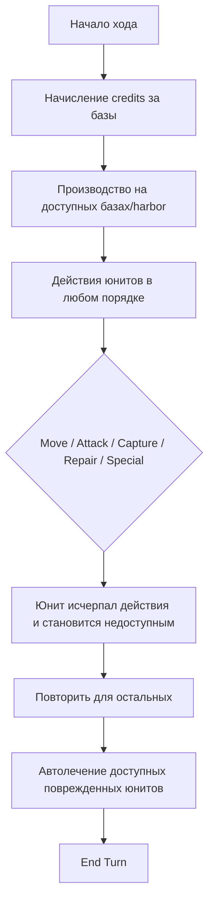
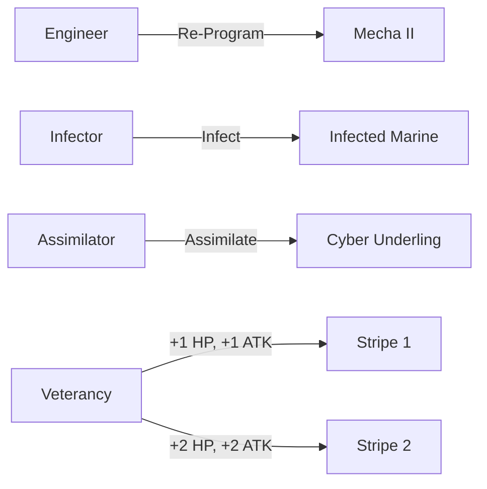
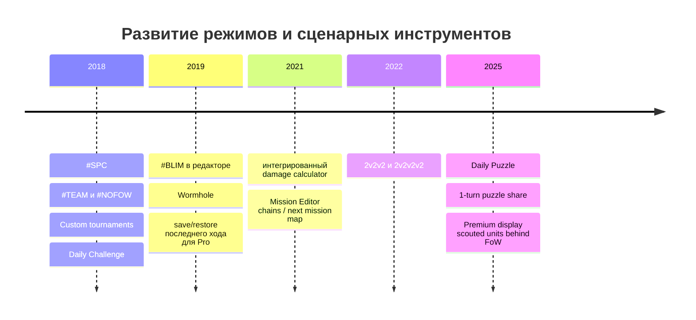

# UniWar

## Исполнительное резюме

Этот справочник собран по публичным источникам, доступным на 18 апреля 2026 года, с приоритетом на официальный сайт разработчика entity["company","Spooky House Studios","game developer"], официальные карточки юнитов, FAQ и `version.txt`; затем — на согласованный community-reference из entity["organization","Fandom","wiki platform"] и на давние, но устойчиво цитируемые объяснения формулы боя из форумов и калькулятора урона, который сам разработчик использовал с разрешения и позднее интегрировал в игру. Важная методологическая оговорка: старые официальные страницы `howtoplay` по-прежнему говорят о **8 юнитах на расу** и **4 типах юнитов**, тогда как текущая официальная страница `unit.page` показывает **11 юнитов на расу**, отдельный класс **amphibian** и полноценные **подводные профили**. Поэтому при конфликте источников я приоритезирую **актуальные карточки юнитов** и **официальный changelog**, а старые учебные страницы использую как базовое описание правил. citeturn0view0turn4search0turn3search0

Боевая система UniWar детерминирована на уровне параметров и вероятностна на уровне бросков. Публично сохранившаяся формула, цитирующая официальный форум, задает вероятность успешного “микро-попадания” как  
\[
p = 0.05 \cdot \big(((A+T_a)-(D+T_d))+B\big)+0.5,\quad p\in[0,1],
\]
после чего выполняется \(6H\) независимых проверок, где \(H\) — текущее здоровье атакующего; итоговый урон равен числу успешных проверок, деленному на 6. Отсюда следует, что математическое ожидание урона равно \(H\cdot p\), а разброс — биномиальный; отдельной подтвержденной механики “критов” в опубликованных формулах и калькуляторе не видно. Это не официальный PDF-мануал, а реконструкция по историческому форумному посту и официально допущенному калькулятору, но именно она лучше всего совпадает с доступными инструментами и сетевым консенсусом игроков. citeturn23view0turn13view0turn8search0

Внутриматчевая экономика проста: в начале хода вы получаете **credits** за захваченные базы; **harbor** нужен для морского производства, но дохода не дает; **medical** не захватывается и ускоряет ремонт в 3 раза. Основные действия в ход — Move, Attack, Stay, Capture, Repair; поврежденные юниты, которые к концу хода остались доступными, автоматически подлечиваются. Способности-исключения — EMP, UV, Plague, Teleport, bury/submerge, а также move-after-attack и двухфазные ходы у Marauder. citeturn4search2turn4search3turn4search4turn10search4

Самые существенные неопределенности публичного корпуса — это **полная числовая матрица бонусов/штрафов рельефа и стоимости движения по всем клеткам для каждого юнита**, а также **точное численное значение cooldown телепорта**. Официальные страницы прямо говорят, что эти данные нужно смотреть во **внутриигровом Info screen**; в открытом вебе они не опубликованы в полном виде. Везде, где числа отсутствуют, я помечаю их как **«неизвестно/неопубликовано»**, а не подставляю догадки. citeturn4search0turn25search0

## Корпус источников и правила интерпретации

Официальный корпус разбивается на четыре слоя. Первый — это `unit.page`, где перечислены все актуальные юниты и их числовые свойства: стоимость, тип, mobility, vision, repair points, атака по пяти классам целей, дальность, защита, armor piercing, underwater penalties и специальные флаги вроде Teleport или EMP/Plague/UV radius. Второй — `howtoplay`, где описаны структура хода, захват, ремонт, базовые террейны и Gang-Up на концептуальном уровне. Третий — `faq.page`, где описаны map hashtags, редактор карт, монетизация и часть мета-систем. Четвертый — `app/version.txt`, где прослеживаются добавления режимов, Daily Challenge/Puzzle, Wormhole, damage calculator, mission editor и командных форматов. citeturn0view0turn4search0turn4search3turn4search4turn4search8turn3search0

Поверх этого используется официальный или полуофициальный внешний слой. Калькулятор UniWar Damage Calculator публикуется отдельно, но прямо пишет, что использует арт и данные игры с разрешения разработчика; официальный сайт отдельно анонсировал интеграцию этого калькулятора в саму игру. Это делает калькулятор важным вторичным источником именно по боевой вероятностной модели и по истории правок статов. citeturn13view0turn8search0

Community-layer важен в тех местах, где официальный веб-массив неполон или устарел. Fandom-страницы полезны для Gang-Up, veterancy, buried-механики, деталей plague, пояснений к attack-after-move / move-after-attack и для отдельных числовых примеров рельефа. Но они не всегда актуальны: например, Fandom-страница Engineer до сих пор говорит о cooldown EMP в **15 раундов**, а текущая официальная карточка Engineer — уже о **10 раундах**. Поэтому всякий раз, когда Fandom расходится с текущими карточками, я беру официальную карточку как приоритет и прямо отмечаю конфликт. citeturn1view0turn19search1turn21view0turn22view0

## Базовые правила партии и экономика хода

Партия в UniWar идет поочередно на гекс-карте. Центральная цель — уничтожить вражескую армию или лишить соперника контроля над экономикой/производством через базы. На старте своего хода игрок получает credits за каждую захваченную базу. Эти кредиты тратятся на производство новых юнитов; гавани нужны для морских юнитов, но сами дохода не приносят; medical-клетки не захватываются и служат для усиленного ремонта. Игра поддерживает асинхронный онлайн, матчи против друзей и незнакомцев, team games и free-for-all. citeturn4search2turn8search0turn10search4

Официальный public ruleset перечисляет базовые действия как **Move, Attack, Stay, Capture, Repair**. После того как юнит исчерпал доступные ему действия, он становится недоступен до следующего собственного хода. Если доступный юнит поврежден и к концу хода так и не был использован, он автоматически лечится сам. Руководство прямо оговаривает, что некоторые свойства юнитов модифицируют эту базовую экономику: есть attack-after-move, move-after-attack, teleport, bury/submerge и специальные race-abilities. citeturn4search3turn25search1

Захват базы и гавани занимает **один полный раунд**. Официальный `howtoplay` фиксирует длительность захвата, а старая, но согласованная community-документация уточняет две дополнительные детали: юнит во время захвата имеет пониженную защиту, может контратаковать, и после завершения захвата сам юнит исчезает. Эти нюансы долговременно цитируются сообществом и не противоречат наблюдаемому поведению игры, но в текущем официальном веб-руководстве они не расписаны так подробно, поэтому их корректнее считать **community consensus по старому official-derived ruleset**. citeturn4search3turn20search0

Ремонт строится вокруг параметра `Repair points` у каждого юнита. Базовый manual-repair использует это число, а затем к нему применяются модификаторы от клетки и от support-юнитов. Medical-клетка дает **ремонт ×3**; Engineer и Assimilator дают соседям **×2 repair rate**; Infector — **×3 repair rate**. Официальные страницы прямо говорят, что несколько support-юнитов ускоряют ремонт еще сильнее, но точная формула стэкинга нескольких support-источников в публичном веб-корпусе не опубликована. citeturn4search0turn1view0turn16view4turn16view5

Схема выше — формализация официальных страниц `Summary` и `Game Mode`. citeturn4search2turn4search3

## Террейн, обзор, скрытность и перемещение

Официальный public manual перечисляет **девять типов террейна**: Plain, Base, Forest, Mountain, Swamp, Desert, Water, Harbor и Medical. Он также прямо говорит, что каждый террейн имеет собственную **стоимость перемещения**, может изменять **attack/defense**, а некоторые клетки для некоторых типов юнитов **непроходимы или неоккупируемы**. Но полная числовая матрица “юрнит × террейн” на официальном сайте **не публикуется**; посетителя отправляют смотреть это во внутреннем `Info screen`. Поэтому ниже я разделяю **точно подтвержденные глобальные эффекты** и **неопубликованные числа**. citeturn4search0turn25search0

| Террейн | Захват | Доход | Производство | Лечение | Влияние на обзор / LOS | Числовые ATK/DEF и cost movement в открытом вебе | Что подтверждено |
|---|---|---:|---|---|---|---|---|
| Plain | нет | 0 | нет | нет | специальных правил не опубликовано | неизвестно/неопубликовано | базовая нейтральная земля |
| Base | да | да | да | нет | специальных правил не опубликовано | неизвестно/неопубликовано | дает credits; нужна для сухопутного производства |
| Forest | нет | 0 | нет | нет | специальных правил не опубликовано | неизвестно/неопубликовано | повышает/меняет боевые статы; сильна для light units |
| Mountain | нет | 0 | нет | нет | специальных правил не опубликовано | неизвестно/неопубликовано | повышает/меняет боевые статы; Ground Heavy не проходит |
| Swamp | нет | 0 | нет | нет | специальных правил не опубликовано | неизвестно/неопубликовано | неблагоприятный terrain по community consensus |
| Desert | нет | 0 | нет | нет | специальных правил не опубликовано | неизвестно/неопубликовано | “open/sand” terrain, удобен для Ground Heavy |
| Water | нет | 0 | нет | нет | специальных правил не опубликовано | неизвестно/неопубликовано | морской домен |
| Harbor | да | нет | да, для aquatic | нет | специальных правил не опубликовано | неизвестно/неопубликовано | нужен для морского производства, credits не дает |
| Medical | нет | 0 | нет | ×3 repair | специальных правил не опубликовано | неизвестно/неопубликовано | не захватывается; ускоряет ремонт втрое |

Официальные свойства этой таблицы — список террейнов, захват base/harbor, доход только от base и ремонт ×3 на medical. Числа движения и модификаторов официально вынесены в in-game info screen и в открытом виде не опубликованы. citeturn4search0turn25search0

Видимое поведение классов по рельефу можно восстановить частично. Community-reference и официальные карточки вместе подтверждают, что **Ground Light** выгоднее на Base / Forest / Mountain, а **Ground Heavy** лучше чувствует себя на open/plain/desert и не может заходить в Mountain. Для Marine Fandom приводит конкретные примеры: Base дает `+2 ATK / +2 DEF`, Forest — `+2 / +3`, Mountain — `+2 / +4`. Для Speeder community-guide предупреждает, что атаковать light-юнитов на лесу и горах невыгодно именно из-за крупных terrain-бонусов, а старые разборы дополнительно указывают на штраф к защите в urban/base-like tiles. Эти числа полезны как проверяемые примеры, но не заменяют отсутствующую полную матрицу. citeturn9search2turn9search3turn10search7

Воздушные юниты движутся поверх любого террейна и используют одинаковую mobility-cost logic для клеток; однако закончить ход на уже занятой клетке нельзя. Старое community summary для aquatic-класса говорит, что “чисто морские” юниты движутся только по Water/Harbor и строятся в Harbor. Современные amphibian-юниты официально существуют и добавляют промежуточный land/water-домен, но старый `howtoplay` их не объясняет, потому что он уже устарел. citeturn19search9turn10search7turn0view0

Fog of War в публичных правилах описывается через **Vision**: юниты видят врага только в пределах своего радиуса обзора. Официальный guided text не публикует отдельную систему “line-of-sight blocking by terrain”; он говорит о видимости через FoW, но не перечисляет клетки, которые блокируют обзор. Поэтому в этом отчете корректно считать, что в публичной документации **terrain-specific LOS effects — неизвестно/неопубликовано**. citeturn4search0turn20search0

Отдельный пласт — скрытность. Underling и Cyber Underling имеют buried/underground-профиль: отдельные `mobility underground`, `vision under`, `defense under` и `resurface bonus +4`. Community summary также добавляет, что buried-юнит нельзя уводить под Medical, Base, Harbor и Water, а Ground Heavy, проходя по клетке с buried-юнитом, наносит ему 1 урон. Для современных морских скрытных юнитов — Submarine, Kraken, Skimmer — официальные карточки задают отдельные `Vision under`, `Attack range under`, `Defense strength under` и штраф `Attack from Underwater penalty`, а changelog калькулятора отдельно фиксирует, что surface units могут бить submerged-цели, но с большими penalties. Точная веб-публикация правил обнаружения submerged units остается неполной; это одна из зон, где приходится опираться на согласованный community lore и на сами карточки. citeturn27view11turn16view6turn15view2turn15view4turn18view6turn13view0turn25search1

## Формулы боя, случайность, Gang-Up, статусы и ремонт

Базовая боевая модель опирается на атаку \(A\), защиту \(D\), terrain-модификаторы атакующего и защитника \(T_a, T_d\), Gang-Up бонус \(B\) и текущее HP атакующего \(H\). Сохранившаяся цитата старого официального форумного поста дает формулу  
\[
p = 0.05 \cdot \big(((A+T_a)-(D+T_d))+B\big)+0.5,
\]
после чего вероятность зажимается в \([0,1]\). Затем игра выполняет \(6H\) независимых проверок; число успехов делится на 6 и дает фактический урон. После этого роли атакующего и защищающегося меняются, и retaliation считается симметрично; только затем обе величины урона списываются в здоровье. Именно поэтому юнит, который “должен умереть от первого удара”, часто все равно успевает ответить. citeturn23view0

Из этой формулы немедленно следуют две полезные производные:  
\[
\mathbb{E}[\text{damage}] = H\cdot p,
\]
\[
\mathrm{Var}(\text{damage}) = \frac{H\cdot p \cdot (1-p)}{6}.
\]
Вторая формула — уже математический вывод из схемы \(X\sim\mathrm{Binomial}(6H,p)\), а не опубликованная строка правил. Но именно она объясняет типичный разброс “около ±1 урона” в обычных боях. Отдельная механика **critical hit** в опубликованных формулах, в справке калькулятора и в официальных карточках юнитов не фигурирует; следовательно, “высокие роллы” следует трактовать как обычные хвосты биномиального распределения, а не как отдельные криты. citeturn23view0turn13view0turn7search1

Armor Piercing в актуальных карточках задается как процент против конкретных классов целей. Официальная веб-справка не публикует отдельную развернутую формулу AP, но калькулятор урона в changelog отдельно фиксирует, что после применения armor piercing **не нужно округлять defense value**. Операционная модель, на которой сходятся калькулятор и community theorycraft, выглядит так:  
\[
D_{\text{eff}}=(D+T_d)\cdot(1-\mathrm{AP}),
\]
после чего \(D_{\text{eff}}\) подставляется в основную формулу шанса. Это надежная инженерная реконструкция, но ее все же честнее маркировать как **не полностью опубликованную разработчиком формулу**. citeturn13view0

Gang-Up — одна из центральных тактических механик. Официальная страница `Specials` говорит лишь, что повторные атаки по той же цели в тот же ход дают бонус, зависящий от расположения атакующих. Community page раскрывает точную геометрию: бонус \(B\) равен \(+1,+2\) или \(+3\); если первая атака была дальнобойной, последующая получает **+1 независимо от позиции**; если первая была ближней, бонус определяется клеткой **относительно предыдущего атакующего**, а не всей цепочки; бонус **не кумулятивный** по нескольким прошлым ударам и сбрасывается при атаке другой цели или при завершении хода. citeturn9search4turn22view0

Практическая памятка по Gang-Up такова:
- **+1** — вторая атака из “соседней” позиции или любая вторая атака после дальнего первого удара;
- **+2** — более глубокий обход вокруг цели, включая в ряде случаев атаку из той же клетки, что и предыдущая, если она освободилась;
- **+3** — удар с противоположной стороны цели относительно предыдущего атакующего.  
Эти топологические правила — community-consensus, но они подробно расписывают то, что официальный текст оставляет на уровне общей идеи. citeturn22view0

Статусы и спецэффекты распределены по трем support-линейкам. **EMP** у Engineer имеет radius 2, отключает Titan-юниты на **1 полный раунд**, действует и на перепрограммированные Mecha II и требует **10 раундов recharge**. **UV** у Assimilator имеет radius 5, наносит **1 урон** всем Sapien и Khralean в радиусе, **не задевает buried units** и требует **11 раундов recharge**. **Plague** у Infector и Salamander официально подтвержден как ability с range 2 и 1 соответственно; полный старый plague-ruleset подробно сохранен на Fandom: зараженные Sapien-юниты теряют 1 HP в начале каждого своего хода, инфекция затем распространяется на соседних Sapien-юнитов, сама по себе до 0 не добивает и снимается лечением на Medical либо repair рядом с Engineer. Для Infector community page отдельно фиксирует, что он может **move + plague** в тот же ход, тогда как Assimilator не может **move + UV**; для Engineer аналогичное ограничение по move+EMP в current official web прописано хуже и в основном восстановимо из старых community notes. citeturn1view0turn16view5turn19search3turn16view4turn14view4turn10search0turn19search0

Механика veterancy не связана с производством и не образует “tech tree”, но фактически является единственной постоянной боевой прокачкой юнита в матче. Community reference указывает, что 1-я и 2-я полосы veterancy дают соответственно **+1 HP и +1 attack**, затем **+2 HP и +2 attack** относительно базового юнита. Для получения полосы юнит должен набрать опыт, равный собственной базовой стоимости; для второй — еще столько же. Формула начисления опыта по добиванию чужих юнитов на Fandom подана как “most prevalent theory”, то есть ее надо маркировать как **community consensus, а не официально опубликованный алгоритм**. citeturn21view0

## Полный список юнитов, классы и эволюции

Нотация в таблицах: `HP` — базовый максимум здоровья; `M/пов./под/после` — `Moves per turn / surface / underground / after attack`; `V/под` — `Vision / Vision under`; `R/под` — `Attack range / Attack range under`; `Atk` — пять чисел в порядке `GL/GH/AIR/AQ/AMPH`; `Def/под` — `Defense strength / Defense strength under`; `RP` — `Repair points`. Важная оговорка: официальные карточки юнитов **не выводят поле Max HP отдельно**; базовое значение **10 HP** и увеличение до 11/12 через veterancy — это community-consensus, совпадающий с калькулятором и исторической формулой боя. citeturn0view0turn21view0turn23view0turn7search2

Перед таблицами — краткая карта эволюций/трансформаций. Официально подтверждены три прямые боевые трансформации: Engineer → Mecha II, Infector → Infected Marine, Assimilator → Cyber Underling. Эти юниты не “эволюционируют” от накопления ресурсов; они создаются только через специальные действия соседнего support-юнита. Отдельной ветки исследований/улучшений базы в открытом ruleset нет. citeturn4search4turn1view0turn16view4turn16view5

### Sapiens

| Юнит | HP | Цена | Тип | M/пов./под/после | V/под | R/под | Atk GL/GH/AIR/AQ/AMPH | Def/под | RP | Особенности |
|---|---:|---:|---|---|---|---|---|---|---:|---|
| Marine | 10* | 100 | наземный лёгкий | 1 / 9 / 0 / 0 | 4 / 0 | 1 / — | 6/3/3/2/6 | 5/0 | 1 | базовая пехота; attack-after-move; под водой штраф -100 |
| Engineer | 10* | 200 | наземный лёгкий | 1 / 6 / 0 / 0 | 3 / 0 | 1 / — | 0/0/0/0/0 | 0/0 | 1 | EMP radius 2; recharge 10; repair ×2 соседям; Re-Program Mecha |
| Mecha II | 10* | 0 | наземный лёгкий | 1 / 8 / 0 / 0 | 3 / 0 | 1 / — | 7/4/4/2/7 | 8/0 | 1 | трансформация Engineer; Teleport |
| Marauder | 10* | 250 | наземный тяжёлый | 2 / 12 / 0 / 0 | 5 / 0 | 1 / — | 8/4/4/4/8 | 7/0 | 1 | две фазы хода; attack-after-move |
| Bopper | 10* | 300 | наземный лёгкий | 1 / 7 / 0 / 0 | 3 / 0 | 3 / — | 3/5/1/5/3 | 0/0 | 1 | AP: GH 25%, AIR 35%, AQ 50%, AMPH 25% |
| Tank | 10* | 400 | наземный тяжёлый | 1 / 8 / 0 / 0 | 3 / 0 | 1 / — | 10/10/0/9/10 | 13/0 | 2 | не бьет AIR |
| Helicopter | 10* | 500 | воздушный | 1 / 12 / 0 / 6 | 5 / 0 | 1 / — | 12/7/10/8/12 | 10/0 | 1 | move-after-attack; под водой штраф -5 |
| Battery | 10* | 600 | наземный тяжёлый | 2 / 5 / 0 / 0 | 4 / 0 | 2-4 / — | 10/6/5/10/10 | 4/0 | 1 | дальнобой; не может двигаться и атаковать в один ход; без защиты в ближнем бою |
| Destroyer | 10* | 800 | морской | 1 / 12 / 0 / 0 | 5 / 0 | 3 / — | 10/10/12/16/10 | 12/0 | 2 | сильнейший surface-корабль; под водой штраф -9 |
| Fuze | 10* | 200 | амфибия | 1 / 9 / 0 / 0 | 4 / 0 | 2 / — | 5/4/1/4/6 | 2/0 | 1 | AP: GL 25%, AQ 20% |
| Submarine | 10* | 400 | морской | 1 / 9 / 9 / 0 | 3 / 2 | 3 / 1-2 | 5/5/3/8/4 | 5/8 | 1 | submerged-профиль; underwater attack penalty -2; AP: GL 15%, GH 30%, AIR 15%, AQ 40%, AMPH 10% |

Источники таблицы Sapiens. citeturn0view0turn1view0turn28view0turn16view0 citeturn15view0turn28view1turn16view1turn18view3 citeturn18view4turn15view1turn18view5

### Khraleans

| Юнит | HP | Цена | Тип | M/пов./под/после | V/под | R/под | Atk GL/GH/AIR/AQ/AMPH | Def/под | RP | Особенности |
|---|---:|---:|---|---|---|---|---|---|---:|---|
| Underling | 10* | 100 | наземный лёгкий | 1 / 11 / 7 / 0 | 3 / 2 | 1 / — | 6/3/0/2/6 | 5/5 | 1 | bury; resurface bonus +4; не бьет AIR |
| Infector | 10* | 250 | наземный лёгкий | 1 / 8 / 0 / 0 | 3 / 0 | 1 / — | 0/0/0/0/0 | 0/0 | 1 | Plague range 2; Infect Marine; repair ×3 соседям |
| Infected Marine | 10* | 0 | наземный лёгкий | 1 / 10 / 0 / 0 | 4 / 0 | 1 / — | 7/4/4/2/7 | 6/0 | 1 | трансформация Infector |
| Swarmer | 10* | 250 | воздушный | 1 / 9 / 0 / 0 | 5 / 0 | 1-2 / — | 8/4/3/6/7 | 4/0 | 1 | дешевый дальнобойный flyer |
| Borfly | 10* | 200 | воздушный | 1 / 6 / 0 / 6 | 3 / 0 | 2-3 / — | 4/6/1/4/4 | 2/0 | 1 | AP: GH 30%, AIR 30%, AQ 50%, AMPH 25%; move-after-attack |
| Garuda | 10* | 350 | воздушный | 1 / 12 / 0 / 0 | 5 / 0 | 1 / — | 7/8/9/8/7 | 9/0 | 2 | тяжелый air-brawler |
| Pinzer | 10* | 450 | наземный тяжёлый | 1 / 8 / 0 / 0 | 3 / 0 | 1 / — | 12/10/3/10/12 | 13/0 | 2 | тяжелый frontline unit |
| Wyrm | 10* | 550 | наземный тяжёлый | 1 / 6 / 0 / 4 | 3 / 0 | 1-3 / — | 10/9/12/10/10 | 4/0 | 1 | гибридная артиллерия; может отвечать в ближнем бою |
| Leviathan | 10* | 600 | морской | 1 / 11 / 0 / 0 | 4 / 0 | 3 / — | 10/10/9/12/10 | 12/0 | 2 | дешевле флагманов других рас при сильных статах |
| Salamander | 10* | 200 | амфибия | 1 / 9 / 0 / 0 | 4 / 0 | 1 / — | 6/4/3/5/6 | 8/0 | 2 | Plague range 1; AP: GL 25%, AQ 30% |
| Kraken | 10* | 350 | морской | 1 / 10 / 10 / 0 | 3 / 3 | 2 / 1 | 6/6/0/6/6 | 8/12 | 2 | submerged-профиль; resurface bonus +3; underwater attack penalty -2; AP: GL 15%, GH 30%, AQ 60%, AMPH 15% |

Источники таблицы Khraleans. citeturn27view11turn16view4turn17view3turn17view2 citeturn15view3turn28view2turn17view4turn17view0 citeturn17view1turn14view4turn15view4

### Titans

| Юнит | HP | Цена | Тип | M/пов./под/после | V/под | R/под | Atk GL/GH/AIR/AQ/AMPH | Def/под | RP | Особенности |
|---|---:|---:|---|---|---|---|---|---|---:|---|
| Mecha | 10* | 100 | наземный лёгкий | 1 / 8 / 0 / 0 | 4 / 0 | 1 / — | 6/3/4/2/6 | 6/0 | 1 | Teleport; disabled 1 round after teleport |
| Assimilator | 10* | 200 | наземный лёгкий | 1 / 6 / 0 / 0 | 3 / 0 | 1 / — | 0/0/0/0/0 | 0/0 | 1 | UV radius 5; 1 damage; recharge 11; repair ×2; Assimilate Underling |
| Cyber Underling | 10* | 0 | наземный лёгкий | 1 / 10 / 6 / 0 | 4 / 2 | 1 / — | 7/4/2/2/7 | 6/6 | 1 | bury; resurface bonus +4; трансформация Assimilator |
| Speeder | 10* | 250 | наземный тяжёлый | 1 / 16 / 0 / 6 | 5 / 0 | 1 / — | 10/5/5/5/8 | 8/0 | 2 | move-after-attack |
| Guardian | 10* | 350 | наземный лёгкий | 1 / 10 / 0 / 0 | 2 / 0 | 1-2 / — | 7/5/7/5/7 | 3/0 | 0 | AP: GH 40%, AQ 45%, AMPH 25%; Teleport |
| Eclipse | 10* | 400 | наземный тяжёлый | 1 / 10 / 0 / 0 | 4 / 0 | 1-2 / — | 10/6/12/5/11 | 10/0 | 2 | Teleport; disabled 1 round after teleport |
| Plasma Tank | 10* | 500 | наземный тяжёлый | 1 / 7 / 0 / 0 | 3 / 0 | 1 / — | 10/12/5/11/10 | 14/0 | 1 | главная heavy-wall единица |
| Walker | 10* | 700 | наземный тяжёлый | 1 / 6 / 0 / 0 | 5 / 0 | 3-5 / — | 10/10/11/10/10 | 5/0 | 1 | move-or-attack; не контратакует в упор |
| Hydronaut | 10* | 800 | морской | 1 / 11 / 0 / 0 | 6 / 0 | 2-4 / — | 12/10/12/13/12 | 10/0 | 2 | не атакует и не защищается в упор |
| Mantisse | 10* | 250 | амфибия | 1 / 11 / 0 / 0 | 4 / 0 | 2 / — | 6/4/2/4/7 | 4/0 | 1 | AP: GL 25%, AIR 10%, AQ 20% |
| Skimmer | 10* | 450 | морской | 1 / 10 / 10 / 0 | 4 / 3 | 3 / 1-2 | 5/5/5/9/5 | 6/9 | 1 | submerged-профиль; underwater attack penalty -2; AP: GL 10%, GH 30%, AIR 20%, AQ 50%, AMPH 15% |

Источники таблицы Titans. citeturn28view3turn16view5turn16view6turn16view7 citeturn14view6turn18view2turn17view5turn18view1 citeturn18view0turn15view5turn18view6turn27view3

Дополнительные оговорки к таблицам. Во-первых, старый `howtoplay` устарел относительно наличия amphibian и подводных профилей; современные цифры — из карточек юнитов. Во-вторых, поле `Moves per turn` в официальных карточках Battery равно 2, хотя accompanying text одновременно говорит, что Battery не может двигаться и атаковать в один ход; это один из редких случаев, где сам официальный веб-интерфейс не объясняет внутреннюю трактовку поля полностью. В-третьих, у teleporting units точный числовой cooldown после телепорта в current public web **не опубликован**; опубликовано только то, что телепорт выключает юнит на 1 раунд и затем требует подзарядки. citeturn4search0turn18view3turn27view10turn18view2turn11search0

## Сетевая игра, рейтинг, карты и сценарные режимы

Официальная главная страница описывает UniWar как асинхронную turn-based strategy с матчами против друзей и незнакомцев, free-for-all и team matches, а также ранговой системой, в которой игрок “двигается вверх по rank, получая очки за победы”. Отдельно официальный турнирный раздел говорит, что очки **Championship Ladder** начисляются именно в championship tournaments. Это означает, что на практике в игре сосуществуют как минимум общий score/rank и отдельный championship-ladder слой. В доступных rules pages нет указаний, что рейтинг меняет боевые формулы, статы юнитов, доход или RNG; его влияние — допуск к форматам, позиционирование в соревновательной лестнице, турнирные ограничения и социальные возможности вроде чата. citeturn8search0turn8search1turn5view2

Уровень score действительно имеет мета-значение. FAQ фиксирует, что для чата нужен verified email и либо **минимум 1550 score и несколько побед**, либо покупной pass. Тот же FAQ объясняет linked accounts и то, как общие устройства могут повлиять на допуск в турниры с ограничениями по score. В турнирных правилах также встречаются матчи `unrated`, `mirrored`, а в части турниров жеребьевка или допуск организуются “by score”. Это именно **мета-слой**, а не механика боя на карте. citeturn5view2turn6search4turn4search7

Публично подтвержденная карта-экосистема UniWar строится не на процедурной генерации карт “на лету”, а на **редакторе карт**, пользовательском браузере карт и сценарных режимах. FAQ говорит, что сообщество создало более **30 000** карт, что публикация карты стоит один **map token**, а опубликованную карту уже нельзя содержательно редактировать; будущие/поздние mission-features включают lock race, usage of all units, objectives, triggers и conditions. Позднейшие патчи в `version.txt` подтверждают развитие Mission Editor, chain-of-missions и поддержку сценариев из нескольких карт. В открытых официальных материалах я не нашел подтверждения именно процедурной map generation; вместо этого подтверждены **ручной редактор** и **карты с тегами и сценарными правилами**. citeturn5view2turn6search0turn3search0

Наиболее важные map/scenario hashtags официально задокументированы в FAQ. `#SPC` переводит карту в Single Player Challenge; `#TEAM` делает такой SPC командным; `#NOFOW` отключает туман войны в SPC; `#AI1/#AI2/#AI3` выбирают алгоритм бота; `#RNG123` задает стартовый random seed и делает исходы атак воспроизводимыми; `#BLITZn` задает блиц-таймер; `#BLIMn` истощает базы с указанного раунда; `#RNGBUILD` и `#RNGBUILDANY` заставляют пустые базы строить случайные бесплатные юниты. Патчноуты дополнительно подтверждают Daily Challenge, Daily Puzzle, 2v2v2 / 2v2v2v2 и Wormhole как режим предварительного просмотра будущих ходов. citeturn5view0turn3search0turn8search0

Таймлайн выше сжат из официального `version.txt` и новостной ленты на главной странице. citeturn3search0turn8search0

## Неопределенности, выводы и список источников

Самое важное “белое пятно” — это **полная числовая terrain-matrix**: стоимость движения по каждому типу клетки для каждого юнита, а также точные attack/defense modifiers для всех сочетаний “юнит × terrain”. Официальный веб прямо признает существование этих данных, но публикует их только во **внутриигровом Info screen**. Поэтому для террейна в этом отчете я дал все официально подтвержденные общие эффекты и отдельные надежные числовые примеры, но не стал выдумывать отсутствующую матрицу. citeturn4search0turn25search0turn9search2

Вторая зона неопределенности — **точный cooldown телепорта** у Mecha / Mecha II / Guardian / Eclipse. Current public official pages подтверждают сам ability, невозможность телепорта на base, отключение юнита на 1 раунд после телепорта и последующую необходимость recharge, но числом этот recharge в web pages не назван. Поэтому корректная формулировка здесь — **«неизвестно/неопубликовано»**. citeturn27view10turn28view0turn14view6turn18view2

Третья зона — точная механика **обнаружения submerged-юнитов** и полная формула стэкинга **нескольких support-ремонтов**. Карточки юнитов подтверждают отдельные подводные статы, penalties и underwater/surface profiles; калькулятор подтверждает, что surface units могут атаковать submerged targets; official abilities подтверждают multipliers repair ×2 и ×3. Но в публичном official web нет полноценного системного документа с “всеми исключениями и precedence rules” для этих двух тем. Поэтому здесь неизбежно приходится пользоваться осторожной реконструкцией и community consensus. citeturn13view0turn15view2turn15view4turn18view6turn1view0turn16view4turn16view5

Приоритетный список источников для этого отчета таков. На первом месте — **официальные карточки юнитов** `unit.page`, потому что именно они содержат актуальные числовые статы для всех 33 юнитов и прямо отражают современный ростер с amphibian и submerged mechanics. На втором — **официальные `howtoplay`, `faq.page` и `version.txt`**, поскольку они описывают ходы, захват, экономику, map tags и историю режимов. На третьем — **UniWar Damage Calculator**, который сам разработчик разрешил использовать и затем интегрировал в игру. На четвертом — **Fandom**, полезный для Gang-Up, veterancy, buried/plague/repair details и разъяснений старой школы. На пятом — **форумы и Reddit**, которые я использовал только там, где official web не публикует точную формулу или механику, и всегда с явной маркировкой уровня уверенности. citeturn0view0turn4search0turn4search3turn4search4turn4search8turn3search0turn13view0turn8search0turn21view0turn22view0turn23view0

Если свести все к практическому выводу, то UniWar — это игра, где решают не только “юнит-контры”, но и **геометрия последовательности атак**, **здоровье как масштаб урона**, **точка рельефа**, **временной горизонт статусов** и **чтение action economy конкретной карточки**. В этом смысле самые “нагруженные” механики — не уникальные способности сами по себе, а сочетание четырех вещей: `HP -> expected damage`, `Gang-Up -> повышение p`, `terrain -> двусторонняя модификация A/D`, `availability/action state -> можно ли еще двигаться, стрелять, чиниться или отвечать`. Именно в этом узле игра и остается глубокой даже спустя годы балансовых патчей. citeturn23view0turn22view0turn4search3turn0view0